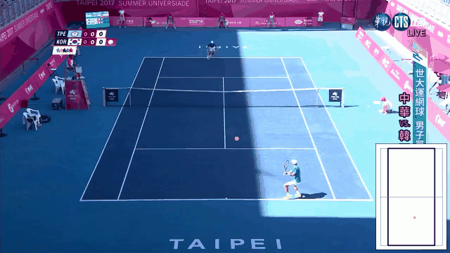

# Tennis Tracking System

A research and demo workspace for tennis video analysis. The repository compares
multiple model families for three core tasks, then packages the strongest pieces
into a runnable pipeline that produces annotated tennis clips.

The system is organized around four parts:

- ball tracking: locate the tennis ball frame by frame;
- court keypoint detection: detect court landmarks and estimate an image-to-court
  homography;
- bounce detection: detect bounce events from a ball trajectory;
- final pipeline: combine ball, court, and bounce modules into one inference
  workflow with overlay video output.

## Demo



[View original MP4 demo](final_model/outputs/test250_game10_clip1.mp4)

## Repository Layout

```text
.
|-- tennis_ball_tracking_comparison/       # TrackNet, TrackNetV2-V5, YOLO, SKeepTrack experiments
|-- courtkeypoint_detection_comparison/    # court landmark detection and homography experiments
|-- bounce_detection_comparison/           # heuristic, GBM, and TCN bounce detection experiments
|-- final_model/                           # packaged inference pipeline and Gradio demo
|-- Dataset/                               # local TrackNet-style dataset, gitignored
|-- remote_results/                        # local/remote generated visual outputs
|-- plans/                                 # research notes and implementation plans
`-- slide_report/                          # presentation/report material
```

Each comparison folder is its own local Python project with its own
`requirements.txt`, training scripts, evaluation scripts, checkpoints, and
README. Commands for those projects should be run from inside the corresponding
folder unless noted otherwise.

## What This Project Does

### Ball Tracking

`tennis_ball_tracking_comparison/` benchmarks tennis-ball localization models on
a TrackNet-style dataset:

- TrackNet;
- TrackNetV2;
- TrackNetV3 tracker plus InpaintNet;
- TrackNetV4 with motion attention;
- TrackNetV5 with temporal self-attention;
- YOLO11m or a local fallback detector;
- experimental SKeepTrack code.

The evaluation reports pixel accuracy, mean absolute error, visibility-aware
metrics, F1 variants, tracking consistency, and FPS.

See [tennis_ball_tracking_comparison/README.md](tennis_ball_tracking_comparison/README.md)
for full model, training, evaluation, and caveat details.

### Court Keypoint Detection

`courtkeypoint_detection_comparison/` detects 14 annotated tennis court
landmarks plus an inferred court-center heatmap channel. Predicted keypoints are
used to estimate a homography from image pixels to a canonical tennis court in
meters.

Compared model families include:

- TrackNet-style court keypoint model;
- ResNet-50 pose model;
- HRNet pose model;
- MobileNetV3-Small pose model.

The evaluation reports PCK, mean keypoint error, homography reprojection error,
homography success rate, parameter count, and FPS.

See [courtkeypoint_detection_comparison/README.md](courtkeypoint_detection_comparison/README.md)
for the keypoint order, data format, training commands, and current results.

### Bounce Detection

`bounce_detection_comparison/` detects bounce frames from ball trajectories. The
task is event timing: a prediction is correct when it matches a ground-truth
bounce event within a frame tolerance.

Compared approaches include:

- a calibrated heuristic scorer;
- a gradient boosting model over engineered trajectory features;
- a dilated temporal convolutional network.

The evaluation reports event precision, recall, F1, AP, tolerance sweeps,
per-game F1, confusion against hit/bounce/none, and scorer FPS.

See [bounce_detection_comparison/README.md](bounce_detection_comparison/README.md)
for the feature pipeline, model details, training commands, and current scores.

### Final Pipeline

`final_model/` wires the component models into one inference API:

```text
input clip or frame directory
  -> TrackNetV4 ball tracking
  -> MobileNetV3 court keypoints
  -> image-to-court homography
  -> GBM bounce detection
  -> qualitative in/out labeling
  -> annotated MP4 plus JSON summary
```

Default checkpoints used by the pipeline:

```text
final_model/tracknetv4_best.pt
courtkeypoint_detection_comparison/checkpoints/mobilenetv3_best.pt
bounce_detection_comparison/checkpoints/gbm_best.pkl
```

## Quick Start

Create a virtual environment from the repository root:

```bash
python -m venv .venv
source .venv/bin/activate
python -m pip install --upgrade pip
```

For the packaged final pipeline:

```bash
pip install -r final_model/requirements.txt
```

Run inference on a video file or a directory of frames:

```bash
python -m final_model.infer Dataset/game1/Clip1 \
  --output final_model/outputs/demo.mp4 \
  --bounds singles \
  --device cpu
```

Use CUDA when available:

```bash
python -m final_model.infer path/to/match.mp4 \
  --output final_model/outputs/match_annotated.mp4 \
  --bounds doubles \
  --device cuda
```

The command prints a JSON summary similar to:

```json
{
  "n_bounces": 3,
  "demo_in_count": 2,
  "demo_out_count": 1,
  "in_out_quality": "qualitative",
  "fps_ball": 24.1,
  "fps_court": 11.8
}
```

Launch the Gradio demo from the repository root:

```bash
python final_model/demo_app.py
```

Export the packaged ball and court models to ONNX:

```bash
python -m final_model.export_onnx \
  --ball final_model/tracknetv4_best.pt \
  --court courtkeypoint_detection_comparison/checkpoints/mobilenetv3_best.pt \
  --out-dir final_model/onnx
```

The bounce GBM checkpoint is a Python pickle, so it is shipped separately unless
the bounce arm is replaced with an ONNX-exportable model.

## Data Layout

The ball-tracking and bounce-detection projects expect a TrackNet-style dataset:

```text
Dataset/
|-- game1/
|   `-- Clip1/
|       |-- 0000.jpg
|       |-- 0001.jpg
|       |-- ...
|       `-- Label.csv
|-- ...
`-- game10/
```

Each `Label.csv` should contain:

```text
file name, visibility, x-coordinate, y-coordinate, status
```

The court keypoint project expects:

```text
courtkeypoint_detection_comparison/data/
|-- data_train.json
|-- data_val.json
`-- images/
    `-- {record_id}.png
```

Large datasets, generated caches, results, and most local research artifacts are
intentionally gitignored. Regenerate split manifests if the dataset moves,
because checked CSV files may contain paths relative to the original workspace.

## Running The Experiments

Install dependencies for an experiment folder before running its scripts:

```bash
pip install -r tennis_ball_tracking_comparison/requirements.txt
pip install -r courtkeypoint_detection_comparison/requirements.txt
pip install -r bounce_detection_comparison/requirements.txt
```

### Ball Tracking

```bash
cd tennis_ball_tracking_comparison

python -m data.subset_selector --dataset_root ../Dataset --output splits.csv

python -m train.train_tracknetv4
python -m evaluation.evaluate \
  --model tracknetv4 \
  --checkpoint checkpoints/tracknetv4_best.pt

python -m comparison.compare_models
python -m comparison.generate_report --results_dir results
```

### Court Keypoint Detection

```bash
cd courtkeypoint_detection_comparison

python -m train.train_mobilenetv3
python -m evaluation.evaluate \
  --model mobilenetv3 \
  --checkpoint checkpoints/mobilenetv3_best.pt \
  --split test \
  --device cuda

python -m comparison.compare_models
python -m comparison.generate_report --results_dir results
```

### Bounce Detection

```bash
cd bounce_detection_comparison

python -m data.subset_selector --dataset_root ../Dataset --output splits.csv
python -m data.export_features --splits_csv splits.csv --output training_features.csv

python -m train.train_gbm
python -m evaluation.evaluate \
  --model gbm \
  --checkpoint checkpoints/gbm_best.pkl

python -m comparison.compare_models --splits_csv splits.csv --split test --results_dir results
python -m comparison.generate_report --results_dir results
```

## Generated Outputs

Common generated artifacts include:

```text
*/checkpoints/                 # trained model weights and calibrated thresholds
*/results/                     # metrics JSON, plots, visualizations, videos
*/cache/                       # reusable generated preprocessing artifacts
final_model/outputs/           # annotated final-pipeline videos
final_model/onnx/              # optional ONNX export bundle
```

The comparison scripts usually write per-model metric JSON files plus a
`results/comparison_summary.json`. Visualization scripts write overlay images
and preview videos.

## Important Conventions

- Run experiment commands with `python -m ...` from the relevant subproject
  directory. Several modules use local absolute imports such as `from data...`
  and `from models...`.
- `-1` coordinates mean "not visible" or "no ball" throughout the ball-tracking
  pipeline.
- TrackNet and TrackNetV4 use `640x368` ball coordinates; court keypoints use
  `640x360`; the final pipeline scales both back to the source frame size before
  combining them.
- Bounce detection in `bounce_detection_comparison/` is benchmarked on
  ground-truth ball trajectories from `Label.csv`. Final pipeline bounces are
  based on predicted ball trajectories.
- In/out labels from the final pipeline are qualitative demo outputs. They
  depend on the estimated court homography and are not benchmarked as a formal
  line-call system.

## Documentation Map

- [Ball tracking comparison README](tennis_ball_tracking_comparison/README.md)
- [Court keypoint detection comparison README](courtkeypoint_detection_comparison/README.md)
- [Bounce detection comparison README](bounce_detection_comparison/README.md)
- [Final model inference CLI](final_model/infer.py)
- [Final model Gradio demo](final_model/demo_app.py)
- [Final model ONNX exporter](final_model/export_onnx.py)
